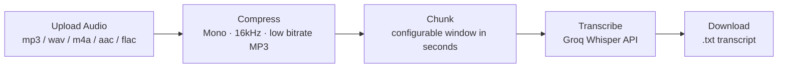
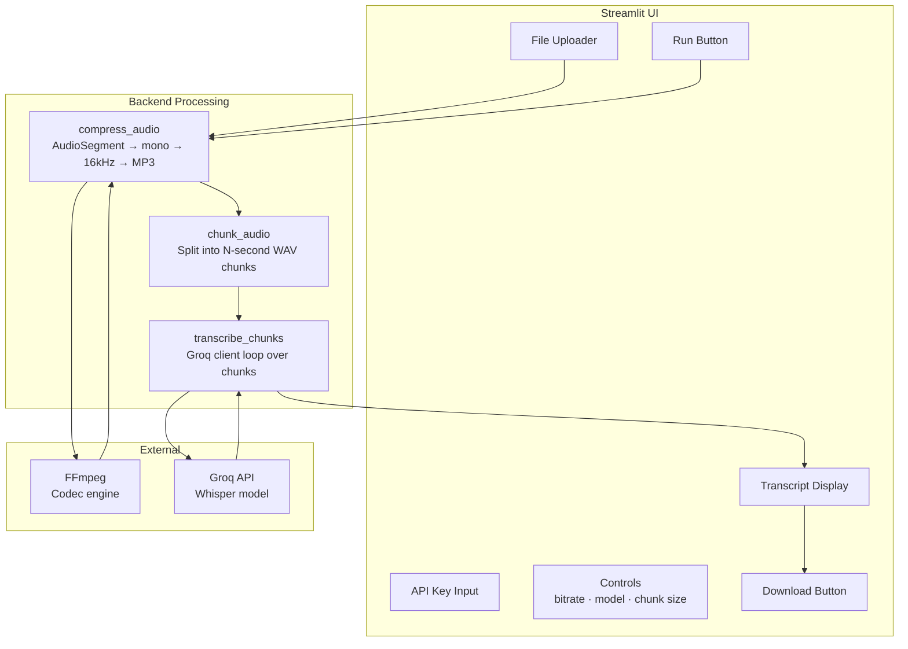
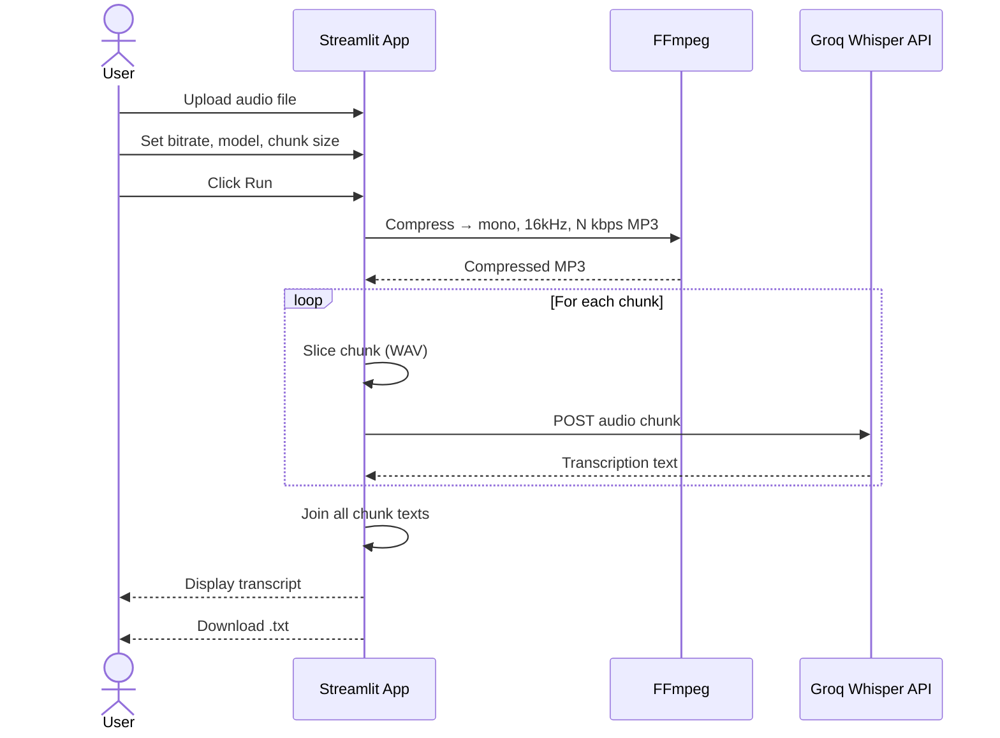
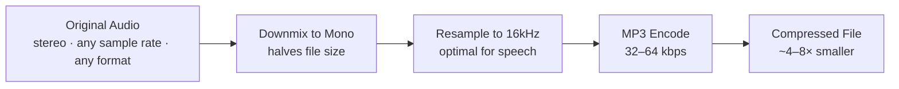

# Meeting Transcriber (Audio to Transcripts)

A Streamlit app that compresses audio files and transcribes them using Groq's Whisper API.

---

## Features

- Accepts MP3, WAV, M4A, AAC, FLAC uploads
- Compresses audio to mono 16kHz MP3 (32–64 kbps)
- Splits audio into configurable chunks to stay within API limits
- Transcribes via Groq Whisper (`whisper-large-v3-turbo` or `whisper-large-v3`)
- Outputs a downloadable `.txt` transcript

---

## Pipeline Overview



---

## Architecture



---

## Data Flow



---

## Setup

### Prerequisites

- Python 3.9+
- FFmpeg installed and accessible

#### Windows

1. Download FFmpeg from [ffmpeg.org](https://ffmpeg.org/download.html)
2. Extract and update `FFMPEG_PATH` in `app.py`:
   ```python
   FFMPEG_PATH = r"C:\path\to\ffmpeg\bin"
   ```

#### macOS / Linux

```bash
# macOS
brew install ffmpeg

# Ubuntu/Debian
sudo apt install ffmpeg
```

Remove the manual `FFMPEG_PATH` block from `app.py` — FFmpeg will be found automatically via `PATH`.

---

### Install & Run

```bash
pip install -r requirements.txt
streamlit run app.py
```

---

## Configuration

| Control | Options | Default | Effect |
|---|---|---|---|
| Target bitrate | 32 / 48 / 64 kbps | 48 kbps | Lower = smaller file, slightly lower quality |
| Whisper model | `whisper-large-v3-turbo` / `whisper-large-v3` | turbo | Turbo is faster; v3 is more accurate |
| Chunk size | 30 – 300 seconds | 60 s | Smaller chunks = more API calls but safer for long files |

---

## Compression Strategy



Speech intelligibility is preserved at 16kHz mono because human voice sits well below 8kHz. The low bitrate MP3 encoding is sufficient for Whisper's input requirements.

---

## File Structure

```
.
├── app.py               # Main Streamlit application
├── requirements.txt     # Python dependencies
└── README.md            # This file
```

---

## Dependencies

| Package | Purpose |
|---|---|
| `streamlit` | Web UI framework |
| `groq` | Groq API client |
| `pydub` | Audio processing and chunking |
| `ffmpeg-python` | FFmpeg bindings (codec backend for pydub) |

---

## API Key

Get a free Groq API key at [console.groq.com](https://console.groq.com). Enter it in the app's text field — it is not stored anywhere.
